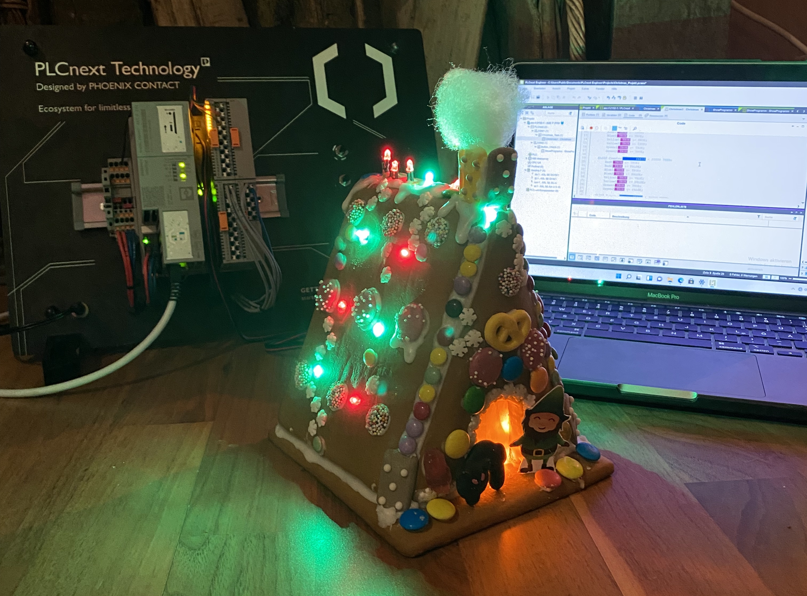
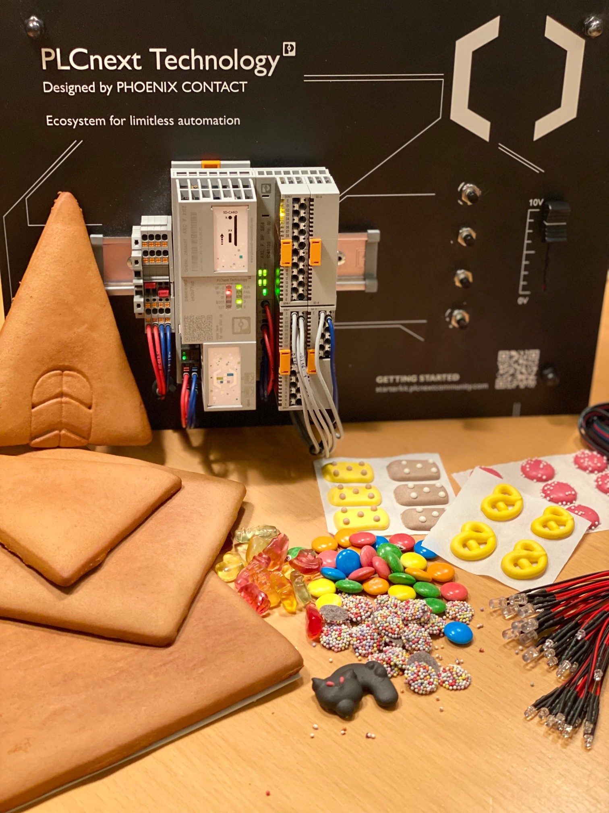
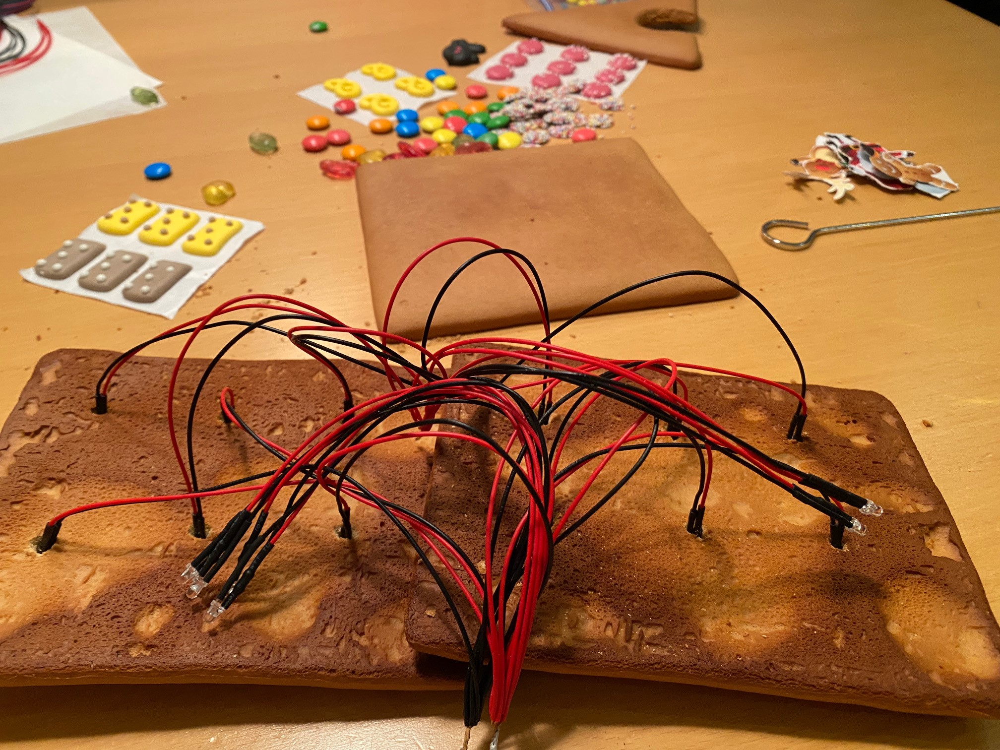
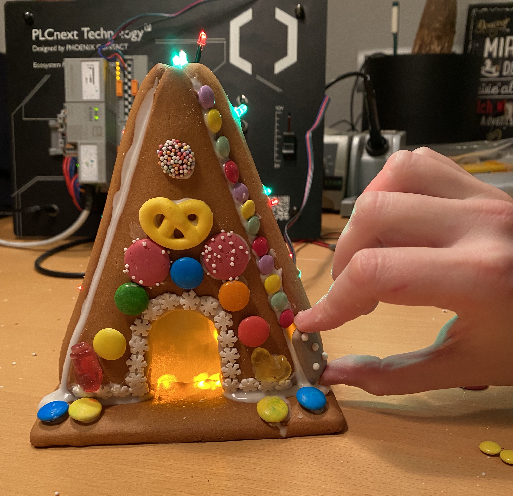

# Illuminated Gingerbread House

In this repository you will find a demo project with a PLCnext Technology Starterkit to automate a Gingerbread House lighting.
## Introduction

This demo application shows the diversity and openness of the open control platform PLCnext Technology using the example of a Gingerbread House lighting.

## Requirements
### Hardware

* PLCnext Technology Starterkit (article no.: 1188165)
* LEDs in your favourite color incl. built-in series resistor (we used following LEDs: size 3mm, height 5,2mm, 20mA, 24V, 20…28V tension, 8000…15000mcd, 40cm cable length)
* Gingerbread House in pieces (homemade or craft kit)
* Icing to glue the individual parts together (we used icing sugar & water, recipe follows)
* Decoration for your Gingerbread House (e.g., sugar pearls, gummy bears, salted pretzels, chocolate, …)

### Software

The following software must be installed on the PC:
* PLCnext Engineer version 2021.9 or later
* PLCnext Control firmware version 2021.0.5 LTS or later

### Installation preparation

1.	Lay down every single piece of the Gingerbread House.

2.	Think about where you want to place the single LED lights. Mark the places with a pencil and cut out all the marked spots with a small, pointed object.

3.	Put the LED lights through the previously cut out holes and glue the individual parts of the Gingerbread House together. Our tip: First place the LEDs, then glue the house together. The other way around it will be difficult to place the LEDs.  (Glue recipe: 100g icing sugar mixed with two tablespoons water)

4. Collect the ground cables and connect them with the ground on the Starterkit.
5. Connect the other wires with the first 8 OUT-Ports of the DO Smart Element.
6. Reset your PLC. For this, push the reset button for 3 seconds during the boot process.
7. Open the PLCnext Engineer demo project.
8. Then download the demo project to the AXC F 2152.

### Usage

You can now select your favourite program via the push buttons and setup the speed with the poti on the Starterkit.

